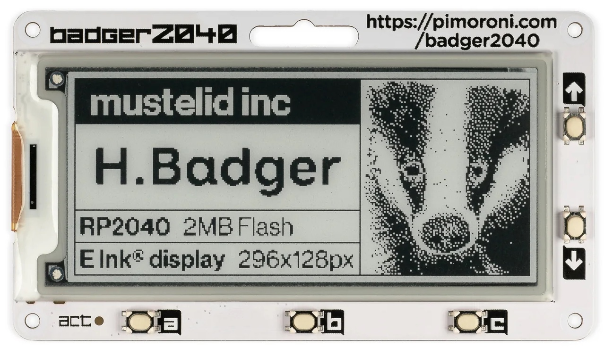

# Embassry Badger2040

This repository contains some code to get you started with using the
[embassy][embassy] framework with the Pimironi [Badger 2040][badger2040].  It
takes inspiration from the official [firmware][badger2040-firmware] for the
device, but porting it to Rust.



## Getting Started

To get started, you need to do these steps, roughly in the right order:

1. Install Rust using [Rustup][rustup].
2. Install `elf2uf2-rs` by running `cargo install --locked elf2uf2-rs --version 2.0.0`

Once you have completed these two steps, this is how you can get some Rust running
on your shiny new board. First, before you can do anything, you need to tell your
board that it should accept a new firmware. You can do this by holding the *boot/usr*
button while you press the *reset* button. These two buttons are located next to each
other on the back side of the board.

Next, you can flash any firmware onto the board by using a `cargo run`. For example,
this is how you can get the USB serial example running on your board:

```
cargo run --bin usb_serial --release
```

To connect to the serial console, you can use the `screen` command. On macOS, the serial
port will be named something like `/dev/cu.usbmodem101`, while on Linux it might be called
`/dev/ttyACM0`.

```
screen /dev/cu.usbmodem101
```

Helpful hint: to get out of screen, you can use `Ctrl+A` followed by `Ctrl+\`.

## License

MIT.

[rustup]: https://rustup.rs/
[embassy]: https://github.com/embassy-rs/embassy
[badger2040]: https://shop.pimoroni.com/products/badger-2040?variant=39752959852627
[badger2040-firmware]: https://github.com/pimoroni/badger2040
